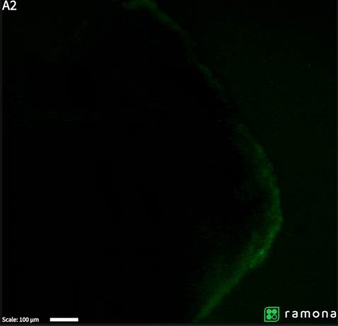

# 🔬 Fluorescence ΔF/F₀ Notebook



A compact Jupyter notebook for analyzing calcium imaging data that:

1. Loads GFP (or other wide‑field) video acquisitions via imageio.
2. Computes mean fluorescence per frame.
3. Normalises to the 10th‑percentile baseline so ΔF/F₀ = 0 % means no change.
4. Computes and plots the ΔF/F₀ per frame.

Simple kick-starter for python analysis of MCAM video data!

## Setup

### Conda

#### 1. Create the environment
```bash
conda env create -f environment.yml
```

#### 2. Activate the environment
```bash
conda activate cardiac_organoid_deltaF
```

#### 3. Start Jupyter Lab
```bash
jupyter lab fluorescence_analysis.ipynb
```

---

### uv

```bash
uv run --with jupyter jupyter lab fluorescence_analysis.ipynb
```

## License

MIT
